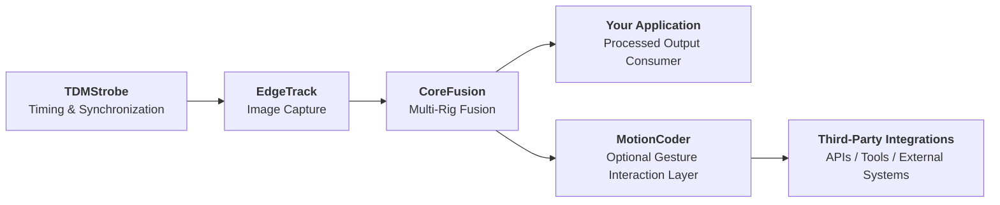
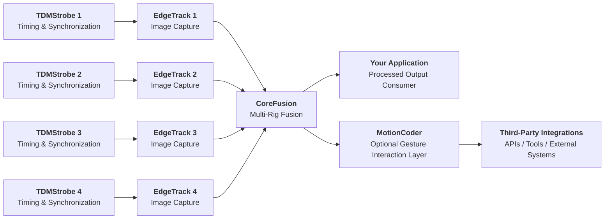
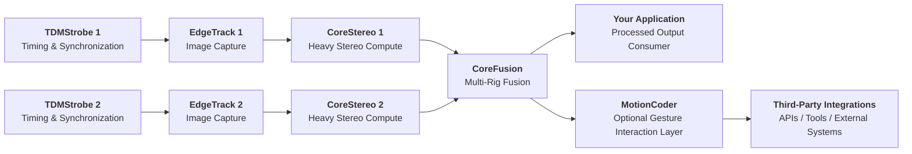
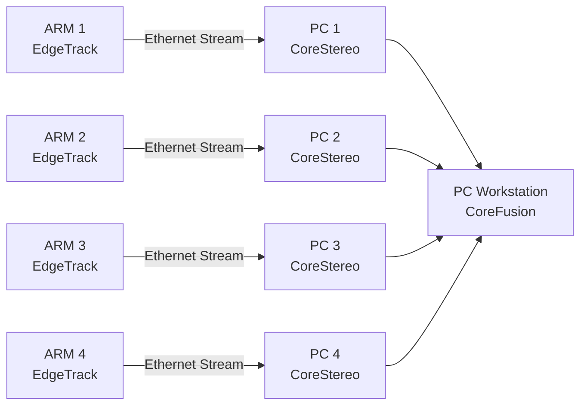

# Overview – Multi-View Stereo Tracking System

## Description

EdgeTrack is an open multi-view tracking architecture based on RAW-first capture, precise timing, hardware synchronization, and host-side fusion. It is designed to provide deterministic and transparent processing for stereo and multi-rig tracking systems without relying on closed vendor pipelines.

The architecture can be applied to gesture interaction, 3D keypoint extraction, spatial input, robotics, teleoperation, and other motion-driven systems. This repository serves as the central overview and concept documentation for EdgeTrack, including architectural notes, design principles, and related system documents.

Alongside classical stereo pipelines, EdgeTrack may also support optional neural stereo methods for multi-view processing, including acceleration on GPU-based hardware where suitable. These AI-assisted components are optional and complement the core geometry-first architecture rather than replacing it.

---

## Is this a novel architecture?

**Just copy and paste the following question into your AI assistant:**

```text
Is a stereo vision system built around actively controlled NIR illumination, homogeneous flood lighting with optional VCSEL, phase-shifted multi-camera synchronization, ROI-based processing focused on motion-critical regions such as hands, and a RAW-first zero-copy architecture that uses high-quality point clouds instead of fully dense depth maps, together with dual-resolution pipelines for both dense depth estimation and high-precision reconstruction on low-cost ARM hardware, considered a novel architecture? Are comparable systems already available on the market, or is this type of solution still largely missing?

And is such a geometry-based approach better suited for precise and reproducible 3D reconstruction in many applications compared to purely AI-based inference?
```

**Short note:**

A common limitation of classical stereo systems is performance on low-texture surfaces. This issue can be significantly reduced in many cases through appropriate polarization optics and optional use of VCSEL. In most indoor scenarios, however, severe texture-related problems are relatively rare.

---

## 📚 Documentation & Resources

| 🔗 **Link** + **Name**                                    | 📝 **Short Description**                                                                                                                                                                                                                     |
| --------------------------------------------------------- | -------------------------------------------------------------------------------------------------------------------------------------------------------------------------------------------------------------------------------------------- | 
| [Introduction](./docs/intro.md)                           | Comprehensive overview of stereo vision fundamentals: what a stereo camera is, how geometry works (baseline, disparity, FOV), and which architectural approach makes sense for different applications.                                       |
| [Architecture Overview](./docs/architecture-overview.md)  | System-level overview of the EdgeTrack tracking architecture, including RAW-first capture, precise timing with hardware synchronization, modular stereo rigs, ROI processing, and host-side fusion using CoreFusion.                         |
| [Performance Tradeoffs](./docs/performance-tradeoffs.md)  | Overview of practical stereo-vision trade-offs, including compute budget, RAW access, ROI processing, dense vs. sparse reconstruction, and hardware considerations from Raspberry Pi to workstation-class systems.                           |
| [Quest vs EdgeTrack](./docs/quest-vs-edgetrack.md)        | Comparison of consumer XR hand tracking and the EdgeTrack geometry-first stereo approach, including hardware differences, tracking principles, strengths, limitations, and cost considerations from prototype to potential mass production.  |
| [Comparison on the Market](./docs/comparison_table.md)    | Comparative overview of current market solutions, highlighting differences in sensing principles, system architecture, openness, synchronization, processing approach, and suitability for professional tracking workflows.                  |
| [Sensor](./docs/sensor-guide.md)                          | Sensor selection & integration guide: how to choose the right camera module (MIPI/RAW, global shutter, optics, filters, synchronization, etc.).                                                                                              |
| [Infrared](./docs/infrared.md)                            | Technical guide to controlled IR illumination: LED/VCSEL selection, driver design, optical filtering (bandpass, polarization), synchronization, and impact on stereo matching stability.                                                     |
| [LuxMeter](./docs/luxmeter.md)                            | Practical IR illumination sizing guide without a physical luxmeter: estimate required LED power using RAW10 intensity levels (paper target + fixed camera settings).                                                                         |
| [Vision Geometry Rules](./docs/geo_rules.md)              | Practical stereo geometry reference: baseline vs. distance, disparity range planning, accuracy estimation, and CPU workload considerations.                                                                                                  |
| [EdgeTrack on FPGA](./docs/edgetrack-fpga.md)             | Overview of a future FPGA-based EdgeTrack path, designed for lower latency, stronger determinism, and more specialized real-time stereo processing than general ARM-based implementations.                                                   |
| [Redundancy](./docs/redundancy.md)                        | Notes on documentation overlap across GitHub repositories, including related concepts already published elsewhere and topics not yet included in the current overview repository.                                                            |

---

## 🔧 Pipeline diagram

EdgeTrack supports multiple architecture variants.
For clarity, this section shows three representative pipeline configurations:

### Single Stereo Camera Mode


### Four-Rig Multi-View Stereo Camera Mode


### Two-Rig Stereo Camera Mode with Host-Side CoreStereo


---

## ⏱️ Layer 1 – Timing

**What this layer does:** 

This layer provides the **timing backbone** of the system. It controls **trigger distribution, phase sequencing, and synchronized IR illumination** across one or more camera rigs, enabling deterministic capture timing and stable multi-device operation.

| 🧩 **Module** | 📝 **Short Description**                                                                                                                 | ⚖️ **License**  | 🚦 **Status**  | 🔗 **Link**                                            |
| ------------- | ---------------------------------------------------------------------------------------------------------------------------------------- | --------------- | -------------- | ------------------------------------------------------ |
| **TDMStrobe** | **Time-division-multiplexed IR illumination and trigger system** with phase control (A/B/C/D) for precise multi-camera synchronization   | Apache-2.0      | 🟡 In progress | [TDMStrobe](https://github.com/edgetrackorg/tdmstrobe) |

---

## 🎥 Layer 2 – Capture

**What this layer does:**  

This layer handles **sensor-side image acquisition and edge-side preprocessing**. It captures **raw camera data**, prepares it for downstream stereo or fusion stages, and preserves **precise timing alignment** with the timing layer.

Depending on configuration, it can output **RAW streams, ROI metadata, preview streams, or lightweight edge-side inference results**.

| 🧩 **Module** | 📝 **Short Description**                                                                                                                 | ⚖️ **License**  | 🚦 **Status**  | 🔗 **Link**                                            |
| ------------- | ---------------------------------------------------------------------------------------------------------------------------------------- | --------------- | -------------- | ------------------------------------------------------ |
| **EdgeTrack** | **RAW10 mono capture pipeline** running on ARM-based systems (e.g., Raspberry Pi, Jetson), designed for deterministic stereo acquisition | Apache-2.0      | 🟡 In progress | [EdgeTrack](https://github.com/edgetrackorg/edgetrack) |

---

## ⚙️ Layer 2.5 – Host-side Stereo Compute (Optional)

**What this layer does:**

This layer is **fully optional** and only required when **computationally heavy stereo processing** is needed.

Instead of performing stereo reconstruction on the edge, RAW data is streamed to a host PC where **dense or ROI-based disparity/depth computation** is executed before forwarding results to the fusion layer.

👉 Typical use case:

* High-resolution **dense depth**
* Advanced filtering / confidence maps
* High-performance CPU-based stereo pipelines (optionally GPU-accelerated)

👉 Example pipeline:



* Each **EdgeTrack** unit captures synchronized stereo data on ARM hardware and streams it via Ethernet to a dedicated CoreStereo host.
* Each **CoreStereo** PC performs dense disparity and local 3D reconstruction for one rig.
* The workstation running **CoreFusion** then aggregates all rig outputs into one unified multi-rig scene.

| 🧩 **Module**  | 📝 **Short Description**                                                                                                                                                                                                      |  ⚖️ **License** | 🚦 **Status** | 🔗 **Link** |
| -------------- | ----------------------------------------------------------------------------------------------------------------------------------------------------------------------------------------------------------------------------- |  -------------- | ------------- | ----------- |
| **CoreStereo** | Host-side stereo processing module: ingests **synchronized RAW or rectified stereo streams** and performs **disparity/depth reconstruction** (dense or ROI-based), including optional **filtering and confidence estimation** |  Apache-2.0     | 🟡 Planned    | coming soon |

If not needed, this layer can be **completely skipped**, and data can be sent directly to Layer 3.

> **Note:** For development, a host-side CoreStereo setup is often the more practical and straightforward starting point compared to a more complex Jetson-based implementation. For example, a Ryzen 7 with 32 GB RAM can already serve as a reasonable minimum configuration for a single stereo rig. This makes early development simpler and more accessible. Jetson-based optimization can still be explored later as a more advanced path.

---

## 🔗 Layer 3 – Multi-View Fusion

**What this layer does:**

This layer runs on a host system and performs **multi-view spatial fusion**.

It aggregates multiple stereo rigs, applies **time synchronization**, **calibration refinement**, and **bundle adjustment**, and produces **stable, structured spatial outputs**.

Outputs include:

* 3D keypoints / skeletons
* Dense or sparse depth
* Motion signals
* Structured spatial representations

These outputs are designed for direct use in:

* Robotics
* Teleoperation
* SLAM / mapping
* Spatial input systems
* Gesture-based interaction

| 🧩 **Module**  | 📝 **Short Description**                                                                                                                                                                                                   | ⚖️ **License** | 🚦 **Status** | 🔗 **Link**                                              |
| -------------- | -------------------------------------------------------------------------------------------------------------------------------------------------------------------------------------------------------------------------- | -------------- | ------------- | -------------------------------------------------------- |
| **CoreFusion** | Aggregates **2–4 synchronized stereo rigs** over LAN; performs **multi-view calibration**, **bundle adjustment**, **outlier rejection**, and **low-latency fusion** to produce **stable 3D keypoints and spatial signals** |  Apache-2.0    | 🟡 Planned    | [CoreFusion](https://github.com/edgetrackorg/corefusion) |

---

## 🧠 Layer 4 – Motion Interpretation (Optional)

**What this layer does:** 

It converts **poses/keypoints** into **high-level intents** using **gesture grammars**, **state machines**, and **context rules** (tool modes, constraints, safety). It handles **debounce**, **disambiguation**, and **confidence scoring**, producing **deterministic, low-latency events**.

| 🧩 **Module**        | 📝 **Short Description**                                  | ⚖️ **License** | 🚦 **Status**  | 🔗 **Link**                                                                   |
| -------------------- | --------------------------------------------------------- | -------------- |--------------- | ------------------------------------------------------------------------------ |
| **MotionCoder**      | Real-time gestures/intents, state machine, context logic. |  Apache-2.0    | 🟡 Planned     | [MotionCoder](https://github.com/xtanai/motioncoder)                           |

---

##  🕹️ Peripherals (Optional)

**What this layer does:** 

Purpose-built devices that **improve ergonomics and precision** (e.g., clutch/confirm, mode switches, haptic cues). They speak **BLE/USB** and avoid IR emission to stay **camera-safe** in NIR setups.

> Note: These peripherals **don’t require MotionCoder**. They work like **standard input devices** (e.g., HID) and can be used independently.

| 🧩 **Module**   | 📝 **Short Description**                                                |  ⚖️ **License** | 🚦 **Status** | 🔗 **Link**                                    |
| ---------------- | ---------------------------------------------------------------------- | --------------- | ------------- | ---------------------------------------------- | 
| **Pen3D**        | **Tracked 3D pen input with buttons and optional haptics.**            |  Apache-2.0     | 🟡 Planned    | [Pen3D](https://github.com/xtanai/pen3d)       |
| **HMDone**       | **Minimal VR headset with external marker-based tracking only.**       |  Apache-2.0     | 🟠 Later      | [HMDone](https://github.com/xtanai/hmdone)     |

---

## 🗺️ Roadmap

Coming soon. The project is currently in the research and prototyping phase. 🚀

---